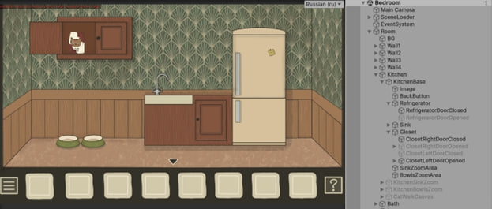

# The Room: Inside

> 2D Point-and-Click Puzzle Game Demo built with Unity

---

---

## About

A 2D point-and-click puzzle game demo heavily inspired by the atmospheric style and surreal mystery of [Rusty Lake](https://www.rustylake.com/). Players explore rooms, interact with the environment, collect inventory items, and solve multi-stage puzzles across several scenes.

Developed as a university coursework project centered on clean C# software architecture, event-driven game mechanics, and test-driven development. **Evaluated with a grade of 9/10.**

---

## Storyline & Key Entity

> *"You wake up in an unfamiliar room. The door is locked, objects around you feel unsettlingly familiar, and your only clues are hidden in the details of the environment..."*

Players navigate through a sequence of puzzle rooms, where every uncovered item and memory brings them closer to understanding how and why they ended up inside.

Central to the gameplay and narrative is the mysterious Cat NPC, which dynamically alters its state and appearance as the player progresses and unlocks key narrative triggers.

---

## Gameplay & Interface Screenshots

| Kitchen & Scene Hierarchy | Settings & Localization |
| :---: | :---: |
|  |  |

* **Environment & Inspection:** Detailed interactive areas with custom inventory scaling, zoomable sub-scenes (sink, bowls, closets), and stateful environment objects.
* **Localization & Options:** Integrated multi-language toggle (English/Russian) and volume controls mapped to custom cat-themed sliders.

---

## Game Architecture & Level Design

### Structural Overview:
* **4-Wall Navigation System:** Scene flow mapped across four directional views per room with interconnected sub-locations (Kitchen, Bathroom).
* **Puzzle Dependency Graph:** Interlinked logic chain including code locks, item combinations, environmental interactions, and notebook clues.
* **UI & Control Mechanics:** Drag-and-drop inventory integration, contextual cursor state changes, and interactive zoom targets.

---

## Key Features & Technical Highlights

* **Point-and-Click Core:** Custom interaction system for object inspection, item collection, and inventory combination mechanics.
* **Event-Driven Architecture:** Decoupled scene components built with C# events and interfaces for maintainable state transitions.
* **Unit Testing:** Test coverage for inventory logic and puzzle solution conditions implemented via **Unity Test Framework**.
* **Scene Management:** State persistence across room transitions to preserve player progress and item interactions.

---

## Tech Stack

* **Game Engine:** Unity (2D Pipeline)
* **Language:** C#
* **Testing:** Unity Test Framework (UTF)
* **Architecture:** OOP, Event Bus pattern, State pattern
