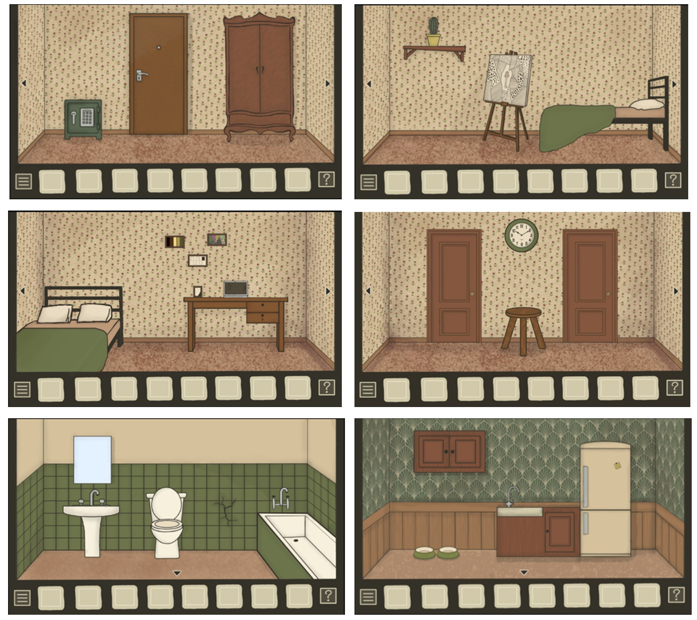
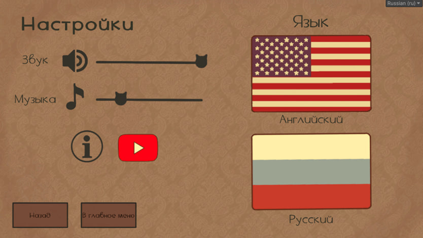
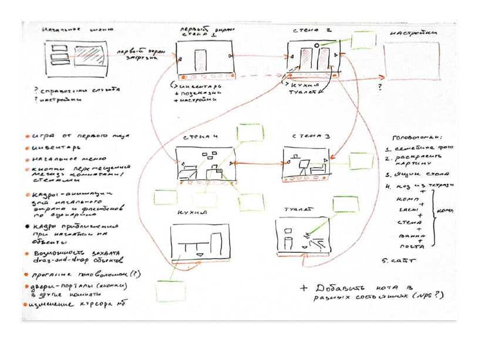

# The Room: Inside

> 2D Point-and-Click Puzzle Game Demo built with Unity

---

---

## About

A 2D point-and-click puzzle game demo heavily inspired by the atmospheric style and surreal mystery of [Rusty Lake](https://www.rustylake.com/). Players explore rooms, interact with the environment, collect inventory items, and solve multi-stage puzzles across several scenes.

Developed as a university coursework project centered on clean C# software architecture, event-driven game mechanics, and test-driven development. **Evaluated with a grade of 9/10.**

---

## Storyline

> *"You wake up in an unfamiliar room. The door is locked, objects around you feel unsettlingly familiar, and your only clues are hidden in the details of the environment..."*

Players navigate through a sequence of puzzle rooms, where every uncovered item brings them closer to understanding how and why they ended up inside. Central to the narrative is the Cat NPC, which dynamically transforms its appearance as progression triggers are unlocked.

---

## Screenshots & Interface

### Environment & Room Perspectives

* **4-Wall Room Navigation:** Complete 360-degree room exploration using side arrows.
* **Sub-Locations:** Interactive secondary scenes including the Kitchen and Bathroom.

### Settings & UI

* **Custom Sliders:** Audio and music controls featuring custom cat-shaped volume indicators.
* **Localization Support:** Instant language switching between English and Russian.

---

## Level Design & Architecture

### Conceptual Flow & System Design:
* **Scene Graph:** Mapped flow between main menu, loading states, 4 main room walls, and sub-locations.
* **Puzzle Chain:** Interconnected logic puzzle dependencies including PC terminals, notebook codes, wall paintings, safe locks, and clock mechanics.
* **Interaction Features:** Context-aware cursor changes, drag-and-drop object interactions, and stateful NPC behavior.

---

## Key Features & Technical Highlights

* **Point-and-Click Core:** Custom interaction system for object inspection, item collection, and inventory combination mechanics.
* **Event-Driven Architecture:** Decoupled scene components built with C# events and interfaces for maintainable state transitions.
* **Unit Testing:** Test coverage for inventory logic and puzzle solution conditions implemented via **Unity Test Framework**.
* **Scene Management:** State persistence across room transitions to preserve player progress and item interactions.

---

## Tech Stack

* **Game Engine:** Unity (2D Pipeline)
* **Language:** C#
* **Testing:** Unity Test Framework (UTF)
* **Architecture:** OOP, Event Bus pattern, State pattern
